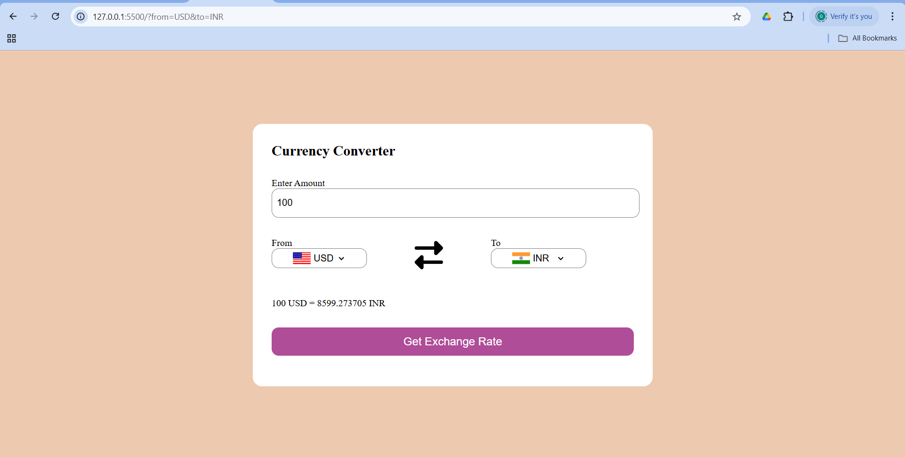

# 💱 Currency Converter Web App

A simple, responsive currency converter built using **HTML**, **CSS**, and **JavaScript**.  
It allows users to convert between major global currencies using real-time exchange rates from a free public API.

---

## 🚀 Features

- 🌐 Real-time currency conversion using live API
- 🏳️ Country flags auto-update based on selected currencies
- 📱 Fully responsive design (works on mobile and desktop)
- ✨ User-friendly interface
- 🔄 Option to swap selected currencies

---

## 🛠️ Technologies Used

- HTML5
- CSS3
- JavaScript (ES6)
- Fetch API
- [Fawaz Ahmed’s Currency API](https://github.com/fawazahmed0/currency-api) via CDN

---

## 📸 Screenshot

---

